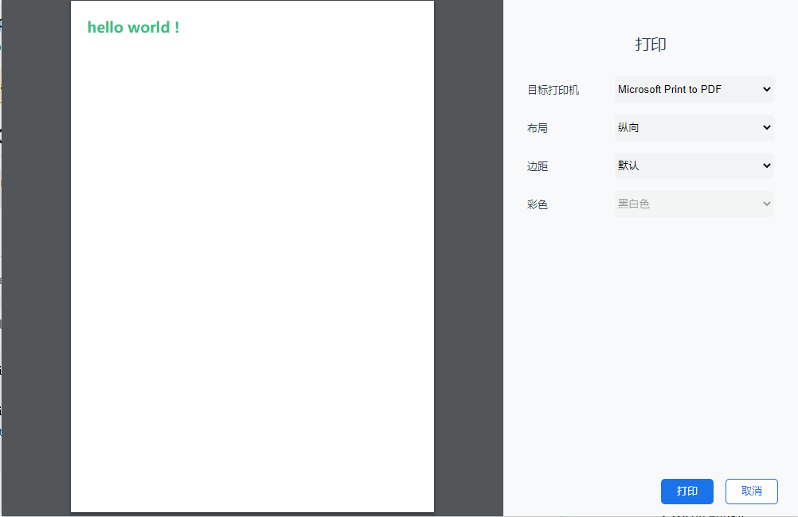

# electron-print-preview

## How to use electron-print-preview in project

1. create a electron project
2. ```npm i electron-printview```
3. a example like ./examples project

```js
const {PdfWindow} =  require("electron-printview");

 PdfWindow.PrintPreview.getIntance().createPdfWindow(event, {
            htmlString:`hello`
        })
```

